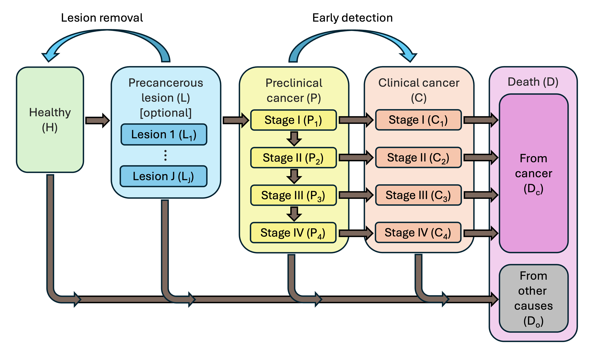

<!-- README.md is generated from README.Rmd. Please edit that file -->

# Discrete-Event Simulation Model for Cancer Interventions and Population Health in R (DESCIPHR)

This GitHub repository is the companion codebase to our manuscript on the Discrete-Event Simulation Model for Cancer Interventions and Population Health in R (DESCIPHR) modeling pipeline. Together, they serve as a tutorial on building, calibrating, and applying a discrete-event simulation cancer model.

{#id .class width="70%" height="70%"}

## File directory

The repository layout follows the [DARTH](http://darthworkgroup.com) coding framework described in:

> Alarid-Escudero F, Krijkamp EM, Pechlivanoglou P, Jalal HJ, Kao SYZ, Yang A, Enns EA. [A Need for Change! A Coding Framework for Improving Transparency in Decision Modeling](https://link.springer.com/article/10.1007/s40273-019-00837-x). [PharmacoEconomics](https://www.springer.com/journal/40273), 2190;37(11):1329–1339. <https://doi.org/10.1007/s40273-019-00837-x>

A description of the folders in the repository:

-   `R`: Contains R functions called in analysis scripts.
-   `_ground_truth`: Contains R scripts run in numeric order to simulate data to demonstrate the pipeline, as well as ground truth data and outputs.
-   `analysis`: Contains the core R scripts to run in numeric order for model calibration, validation, and application. Running `00_create_priors.R` is optional and applies the target-informed prior algorithm described in the manuscript. For calibration, the scripts in either `02_IMABC` or `02_BayCANN` can be run depending on user preference.
-   `data`: Contains the default input data for the model and for calibration, including the prior distributions.
-   `figs`: Contains figures, including those generated by the analysis scripts.
-   `output`: Contains other outputs generated by the analysis scripts.
-   `stan`: Contains Stan code required for performing model calibration with Bayesian Calibration using Artificial Neural Networks (BayCANN).
-   `tests`: Contains unit tests.

The `slurm` subfolders within `_ground_truth` and `analysis` contain `sbatch` scripts to submit the corresponding analyses to a SLURM scheduler. These are not required for running the code, but are included for users who want to run the code on a high-performance computing cluster. To receive email notifications on the job status, add the following lines to the script header, replacing "your_address@site.com" with your email address:

```{r, engine = 'bash', eval=FALSE}
#SBATCH --mail-user=your_address@site.com
#SBATCH --mail-type=ALL
```

## Installation

1.  Install [R and RStudio](https://www.rstudio.com/products/rstudio/download/) if you have not already.
2.  Clone the repo by navigating to the desired parent directory in your terminal application and entering:

```{r, engine = 'bash', eval=FALSE}
git clone https://github.com/sjpi22/tutorial_cancer_modeling_des.git
```

3.  Open the RStudio project `tutorial_cancer_modeling_des.Rproj`.
4.  Modify the analysis scripts and data inputs as needed.

## Citation

You can cite the R code in this repository using "we based our analysis using the R code from Pi S et al. (2025)". Here is the full bibliographic reference to include in your reference list for the R code (don't forget to update the 'last accessed' date):

> Pi S, Rutter CM, Pineda-Antunez C, Chen JH, Goldhaber-Fiebert JD, Alarid-Escudero F. GitHub. sjpi22/tutorial_cancer_modeling_des: Code for tutorial on cancer modeling with discrete event simulation. Available from: <https://github.com/sjpi22/tutorial_cancer_modeling_des>

If using Incremental Mixture Approximate Bayesian Computation (IMABC) to calibrate, please also cite:

> Rutter CM, Ozik J, DeYoreo M, Collier N. Microsimulation model calibration using Incremental Mixture Approximate Bayesian Computation. Ann Appl Stat. 2019 Dec;13(4):2189–212.

If using Bayesian Calibration using Artificial Neural Networks (BayCANN) to calibrate, please also cite:

> Jalal H, Trikalinos TA, Alarid-Escudero F. BayCANN: Streamlining Bayesian calibration with artificial neural network metamodeling. Front Physiol. 2021 May 25;12:662314.

and

> Pineda-Antunez C, Seguin C, van Duuren LA, Knudsen AB, Davidi B, Nascimento de Lima P, et al. Emulator-Based Bayesian Calibration of the CISNET Colorectal Cancer Models. Med Decis Making. 2024 Jul 1;44(5):543–53.

If you adapted the code, you should indicate "Adapted from:" or "Based on" so it is understood that you modified the code. For more information on how to cite computer code, we refer the user to review [Writing Code (from MIT Research Guide)](https://integrity.mit.edu/handbook/writing-code), which provides examples of how and when to cite computer code.

## Acknowledgments

This README file was adapted from the README.Rmd file of 

> Alarid-Escudero F, Krijkamp EM, Enns EA, Yang A, Hunink MGM, Pechlivanoglou P, Jalal H (2022). R Code for A Tutorial on Time-Dependent Cohort State-Transition Models in R using a Cost-Effectiveness Analysis Example (Version v0.2.0). Zenodo. [10.5281/zenodo.6620902](https://www.doi.org/10.5281/zenodo.6620902). Last accessed 9 May 2025.
